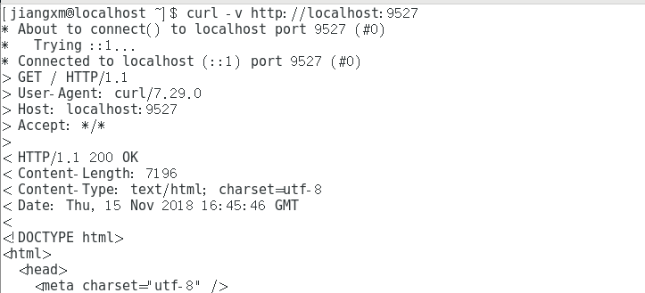
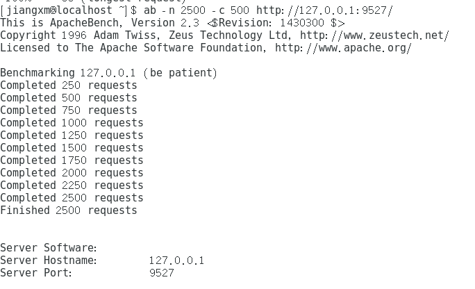
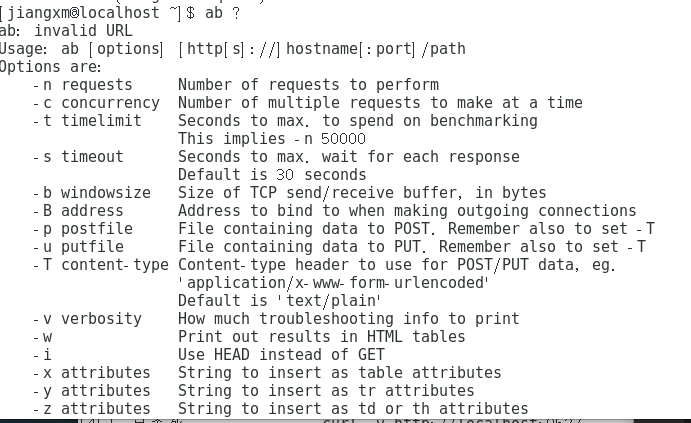

1. 本次简单cloudgo应用开发使用了beego框架，选用beego框架的理由如下：
- 最主要的原因就是它的官方文档有中文，这样方便我这样的小白入门
- 其次beego是基于mvc架构的，而且RESTful支持，还有自身的bee工具帮助快速建立项目
2. 使用curl测试，截图如下：  
  
3. 使用ab测试，截图如下：(进行ab测试需要安装ab `yum -y install httpd-tools`)  
  
- 重要参数解释，在cmd中直接"ab ?"查看参数的意义，截图如下:  
  
可见之前使用的"-n"表示总的用来进行压力测试的次数，"-c"表示同一时间并发的次数  

